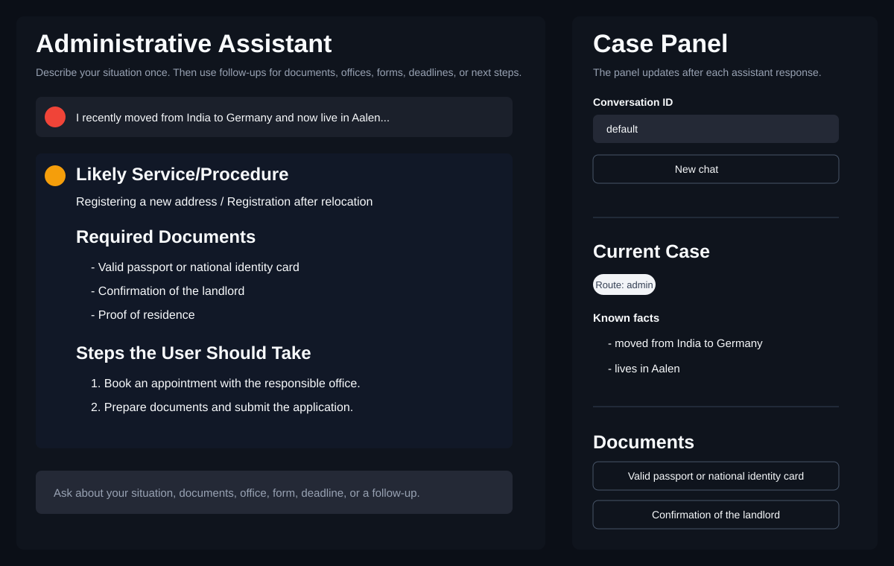
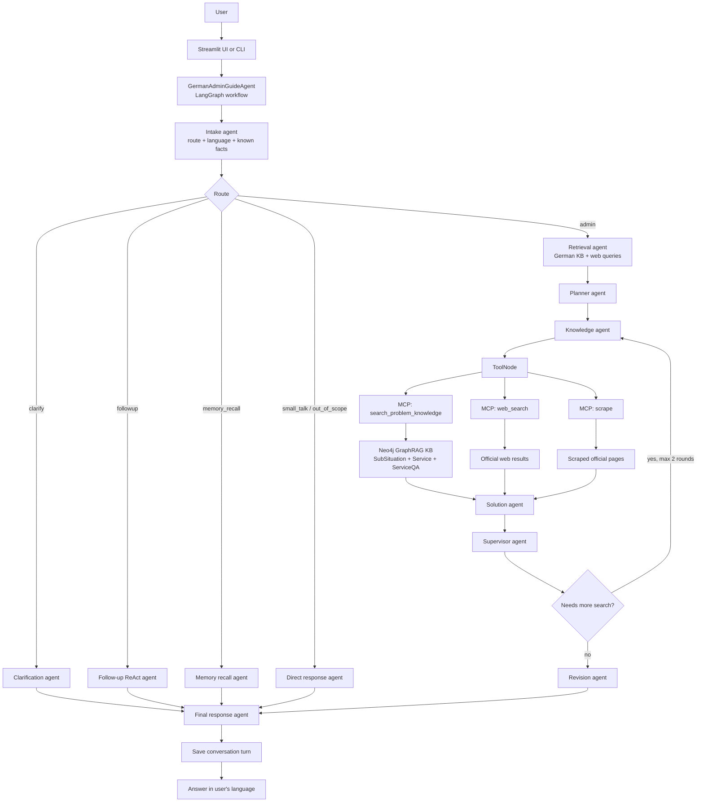
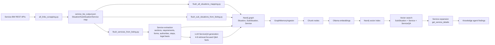

# German Administrative Assistant

German Administrative Assistant is a multi-agent GraphRAG system for German public-administration guidance. It helps users describe a real-life situation in normal language, maps that situation to German administrative procedures, searches a Neo4j knowledge graph built from Service-BW data, optionally enriches with official web results, and returns practical guidance in the user's language.

The system is designed for questions such as:

```text
In Marxzell 76359, I moved into a new apartment.
Which registration procedure applies, which office is responsible,
and what documents do I need?
```

The assistant is not legal advice. It is a guidance layer that helps users identify likely procedures, required documents, responsible offices, next steps, and useful official sources.



## Documentation

- [Setup Guide](docs/SETUP.md): install, configure, run, build the knowledge base, and run evaluation.
- [Technologies And Rationale](docs/TECHNOLOGIES.md): which technologies are used and why.
- [Challenges And Solutions](docs/CHALLENGES.md): problems faced during implementation and how they were solved.
- [Evaluation Flow](evaluation_flow/README.md): how to run question-based evaluation with a judge agent.

## What The Project Does

- Classifies each user message as admin question, clarification, follow-up, memory recall, small talk, or out of scope.
- Converts plain-language questions into compact German administrative search queries.
- Searches a Neo4j graph of Service-BW situations, sub-situations, services, requirements, documents, forms, authorities, process steps, legal bases, goals, and dependency problems.
- Adds an extra `ServiceQA` layer: each service can have precomputed German question-answer facts that are embedded for better retrieval.
- Uses vector search over `SubSituation`, `Service`, and `ServiceQA` chunks.
- Expands matching graph nodes into full service details before answer generation.
- Uses official web search and page scraping when the local graph is not enough.
- Separates answer drafting, supervision, revision, and final translation into different agents.
- Provides both a CLI and a Streamlit frontend.
- Includes a separate evaluation flow that sends many questions through the assistant and grades the answers with a judge LLM.

## High-Level Architecture



## Knowledge Base And Retrieval Flow



### Why ServiceQA Exists

Raw service pages often contain official headings and dense text. Users usually ask in practical question form, for example "Do I still need a Wohnungsgeberbestätigung if I have a rental contract?" The `ServiceQA` layer stores short, grounded question-answer facts for each service and embeds them using the existing chunk pipeline.

The retrieval path is:

```text
User question
  -> vector search ServiceQA
  -> read service_id / HAS_QA relationship
  -> load full linked Service details
  -> answer from service details and official web evidence
```

`ServiceQA` is therefore not a separate final-answer database. It is a retrieval shortcut that helps the assistant find the correct service.

## Service-BW Data Collection

Service-BW is not scraped like a normal static website. The visible pages behave like a web application, so simple HTML scraping does not reliably expose the structured service content. The project therefore uses the Service-BW REST API endpoints behind the site.

Important API patterns used by the project:

```text
GET https://www.service-bw.de/rest/api/lebenslagen/gruppen
GET https://www.service-bw.de/rest/api/lebenslagen/{situation_id}
GET https://www.service-bw.de/rest/api/leistungen/{service_id}
```

The crawler first reads the life-situation groups, then walks each `lebenslagenbaum`, extracts sub-situations, and collects linked `leistungen` service IDs. Individual service pages are then read through the service API and converted into graph nodes.

More details are documented in [Challenges And Solutions](docs/CHALLENGES.md).

## Project Structure

```text
app.py
    CLI chat entry point.

frontend/streamlit_app.py
    Streamlit frontend with chat, active-agent status, case panel,
    document follow-up buttons, useful links, and debug state.

brain/agents/german_admin/
    Multi-agent workflow. graph.py wires the LangGraph state machine.

brain/prompts.py
    Prompts for intake, retrieval, planning, solution, supervision,
    revision, translation, service extraction, summaries, and ServiceQA.

brain/llm.py
    Shared LLM wrapper for Ollama and Groq.

brain/memory/
    Conversation memory implementations and factory.

brain/checkpoint.py
    LangGraph checkpoint factory.

client/web_client.py
    MCP stdio client used by agent tools.

server_tools/
    MCP server exposing search_problem_knowledge, service_details,
    web_search, and scrape.

server_tools/tools/graph_tools.py
    Neo4j GraphRAG retrieval layer.

graph_db.py
    Neo4j connection manager, chunking, entity extraction, embeddings,
    vector index handling, and vector Cypher search.

db_schema/services.py
    Graph writer for Service-BW data and ServiceQA.

scrapping/
    Service-BW API crawler, page/API scraper, extraction pipelines,
    flush scripts, and backfill scripts.

evaluation_flow/
    Separate evaluation runner, question file, judge agent, and results.

docs/
    Setup, technology rationale, and implementation challenges.
```

## Runtime Paths

### Full Administrative Question

```text
User -> Intake -> Retrieval -> Planner -> Knowledge -> Solution -> Supervisor -> Revision -> Final
```

### Clarification

```text
User -> Intake -> Clarification -> Final
```

Used only when the administrative domain is too unclear to search safely.

### Follow-Up

```text
User -> Intake -> Follow-up ReAct agent -> Final
```

Used for contextual questions after a previous answer.

### Memory Recall

```text
User -> Intake -> Memory recall -> Final
```

Used when the user asks what was discussed before.

### Small Talk Or Out Of Scope

```text
User -> Intake -> Direct response -> Final
```

## Main Commands

Install and configure the project using [docs/SETUP.md](docs/SETUP.md).

Run the frontend:

```bash
streamlit run frontend/streamlit_app.py
```

Run the CLI:

```bash
python3 app.py
```

Build the Service-BW listing file:

```bash
python3 -m scrapping.all_links_scrapping
```

Build/enrich the Neo4j knowledge graph:

```bash
python3 -m scrapping.flush_all_situations_mapping
python3 -m scrapping.flush_sub_situations_from_listing
python3 -m scrapping.flush_services_from_listing
```

Backfill ServiceQA for existing services:

```bash
python3 scrapping/backfill_service_qa.py
```

Run a small evaluation:

```bash
python3 evaluation_flow/run_evaluation.py --limit 10
```

## Evaluation

The evaluation flow is intentionally separated from the main application. It reads one question per line from [evaluation_flow/questions.txt](evaluation_flow/questions.txt), sends each question through the assistant, and asks a judge LLM to score the answer.

Outputs are stored under:

```text
evaluation_flow/results/
```

Each run produces:

- `results.jsonl`: full per-question details.
- `results.csv`: spreadsheet-friendly results.
- `summary.json`: aggregate score, rank counts, and satisfactory rate.

The current question set is focused on real Service-BW procedure names and local context such as `Marxzell 76359`, so it tests the system against services that should exist in the knowledge base.

## Current Limitations

- The assistant provides administrative guidance, not legal advice.
- Official rules, forms, fees, and responsible offices can change.
- Retrieval quality depends on the completeness and freshness of the Neo4j graph.
- Service-BW pages can contain regionalized content; local details may require web fallback.
- `ServiceQA` improves matching but final answers must still be grounded in linked service details and official sources.
- The judge agent is useful for evaluation, but its score should be manually reviewed for important thesis results.
