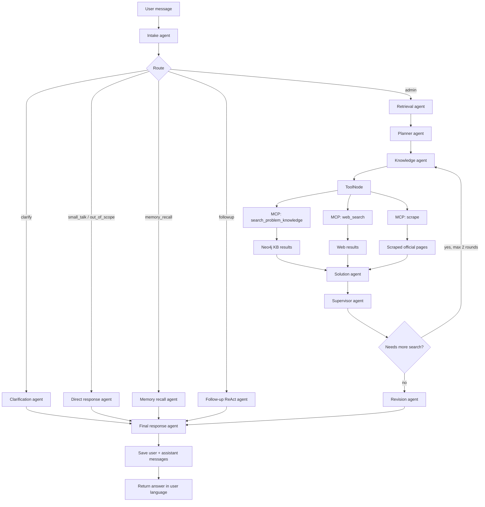
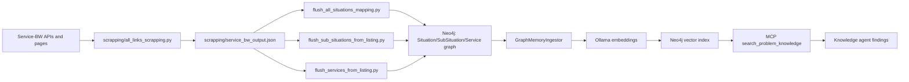

# German Administrative Assistant

German Administrative Assistant is a multi-agent system for helping people understand German public-administration procedures from normal, real-life questions.

Instead of expecting the user to know official German terms like `Wohnsitz anmelden`, `Aufenthaltstitel beantragen`, or `Wohnungsgeberbestätigung`, the assistant accepts a situation in plain language, classifies the problem, searches a Neo4j knowledge graph built from Service-BW data, enriches with official web results when needed, and returns practical guidance in the user's language.


## The Problem

German public administration is procedure-driven. A newcomer often knows their situation but not the official procedure name, responsible authority, required documents, or correct office.

Example:

```text
I recently moved from India to Germany and now live in Aalen.
Which registration procedure applies to me, which office should I contact,
and what documents do I need?
```

A keyword-only chatbot can easily search the wrong thing or force every follow-up through the same heavy workflow. This project solves that by separating intake, retrieval, knowledge search, answer drafting, quality control, memory recall, and follow-up handling into separate agents.

## What The Project Achieves

- Converts user situations into compact German administrative search queries.
- Routes each message to the right path: full admin workflow, clarification, small talk, memory recall, or contextual follow-up.
- Uses a Neo4j graph knowledge base with Service-BW situations, sub-situations, services, requirements, documents, authorities, forms, process steps, legal bases, and related goals/problems.
- Uses Ollama embeddings for vector search against the knowledge graph.
- Uses MCP tools for knowledge search, web search, and page scraping.
- Uses LangGraph for the multi-agent workflow and optional checkpointing.
- Keeps user/assistant conversation memory separate from LangGraph checkpoint state.
- Supports Ollama or Groq chat models through one `Llm` wrapper.
- Provides a Streamlit frontend with a chat panel and a sticky case panel.
- Lets users click documents in the case panel to ask focused follow-up questions.

## Real-World Use Cases

- A worker moves to Germany and needs residence registration or a residence permit.
- A student needs to understand which authority handles a procedure.
- A family wants to know which documents to prepare before visiting a German office.
- A user asks a follow-up like "I already have a rental contract, do I still need the landlord confirmation?"
- A support team wants first-level administrative guidance before forwarding people to official authorities.
- A civic-tech project needs a retrieval-backed interface for public services.

The assistant is not legal advice. It is a guidance layer that helps users understand the likely procedure, required documents, next steps, and official sources.

## High-Level Architecture

```text
User
  |
  | Streamlit UI or CLI
  v
GermanAdminGuideAgent
  |
  | LangGraph workflow
  v
Intake -> Route -> Admin workflow / Follow-up / Memory recall / Clarification / Direct response
  |
  | MCP tools when retrieval is needed
  v
Neo4j knowledge graph + web search + scraper
  |
  v
Grounded final answer + saved conversation turn
```

## Agent Flow



## Knowledge Base Flow



## Project Structure

```text
app.py
    CLI entry point.

frontend/streamlit_app.py
    Streamlit app with chat, sticky case panel, active agent status,
    document follow-up buttons, useful links, and debug state.

brain/agents/german_admin/
    Main multi-agent implementation. Each agent has its own file and
    schema in schemas.py. graph.py wires the LangGraph workflow.

brain/prompts.py
    System and task prompts for intake, retrieval, planning, solution,
    supervision, revision, translation, memory recall, and follow-up.

brain/llm.py
    Shared LLM wrapper. Supports Ollama and Groq providers.

brain/memory/
    Conversation memory implementations:
    SQLite, Postgres, Qdrant class, and memory factory.

brain/checkpoint.py
    LangGraph checkpoint factory. Uses in-memory checkpoints by default
    or PostgresSaver when LANGGRAPH_POSTGRES_URL is configured.

brain/tool_registry.py
    Converts MCP-backed functions into LangChain StructuredTool objects.

client/web_client.py
    MCP stdio client used by the agent tools.

server_tools/
    MCP server exposing web_search, scrape, search_problem_knowledge,
    and service_details.

server_tools/tools/graph_tools.py
    Neo4j retrieval layer for vector search, SubSituation matching,
    service expansion, and service detail retrieval.

graph_db.py
    Neo4j connection manager, chunking, entity extraction, embeddings,
    and vector Cypher search.

db_schema/services.py
    Graph writer for situations, services, sections, requirements,
    documents, authorities, forms, process steps, legal bases, goals,
    dependencies, and embedding chunks.

scrapping/
    Service-BW crawling, page scraping, extraction, and flush scripts
    for building the knowledge graph.

logs/
    Runtime logs and MCP call/result logs.
```

## Main Runtime Paths

### 1. Full administrative question

```text
User -> Intake -> Retrieval -> Planner -> Knowledge -> Solution -> Supervisor -> Revision -> Final
```

Used when the user describes a clear German administrative issue.

### 2. Clarification

```text
User -> Intake -> Clarification -> Final
```

Used when the user likely needs administrative help but the situation is too unclear to search safely.

### 3. Follow-up

```text
User -> Intake -> Follow-up ReAct agent -> Final
```

Used for short contextual questions after a previous answer. The follow-up agent receives prior conversation memory and can use web tools, but it does not rerun the full administrative workflow.

### 4. Memory recall

```text
User -> Intake -> Memory recall -> Final
```

Used when the user asks what was discussed before or asks for the conversation history.

### 5. Small talk / out of scope

```text
User -> Intake -> Direct response -> Final
```

Used for greetings, thanks, or messages outside German administrative guidance.

## State Passed Between Agents

The graph state is defined in `brain/agents/german_admin/schemas.py`.

Important fields:

- `query`: current user message
- `route`: selected route from intake
- `target_language`: language for final response
- `intake`: problem type, known facts, missing information, search terms
- `knowledge_query` and `knowledge_queries`: compact German KB situation queries
- `german_search_terms` and `web_search_terms`: retrieval helper terms
- `plan`: retrieval strategy
- `findings`: KB, service detail, web, and scrape findings
- `draft_answer`: internal German answer
- `supervisor`: quality-control result
- `response`: final user-facing answer

The frontend reads the latest graph state through `GermanAdminGuideAgent.get_last_state()` to build the case panel.

## Memory And Checkpoints

The project intentionally separates conversation memory from LangGraph checkpoints.

**Conversation memory**

Used by intake, follow-up, and memory recall. It stores clean user/assistant turns.

Current factory behavior:

- `CONVERSATION_MEMORY_BACKEND=sqlite` uses `SqlConversationMemory`.
- `CONVERSATION_MEMORY_BACKEND=postgres` uses `PostgresConversationMemory`.
- `CONVERSATION_MEMORY_BACKEND=auto` uses Postgres if `CONVERSATION_POSTGRES_URL` is set, otherwise SQLite.

**LangGraph checkpoints**

Used to persist graph state. By default the project uses an in-memory saver. If `LANGGRAPH_POSTGRES_URL` is configured, it uses LangGraph `PostgresSaver`.

**Qdrant**

`QdrantConversationMemory` exists as a semantic memory implementation, but it is not the default memory factory path in the current code. It can be integrated later for long-term semantic recall.

## Models

The project uses `brain/llm.py` as the model wrapper.

Supported providers:

- `ollama`
- `groq`

Configuration is in `config.py`.

The default design keeps embeddings on Ollama:

```text
OLLAMA_EMBEDDING_MODEL=mxbai-embed-large
```

This matters because the Neo4j vector index and KB chunks are built with that embedding model. Changing the embedding model requires rebuilding the knowledge base embeddings.

Quality-control agents use `QUALITY_LLM_PROVIDER`, which is useful for using a stronger model for supervisor/revision while keeping other agents local.

## MCP Tools

The MCP server is in `server_tools/__init__.py`.

Available tools:

- `web_search`: uses DuckDuckGo/DDGS search.
- `scrape`: fetches a URL and extracts readable page text.
- `search_problem_knowledge`: searches the Neo4j German administration KB.
- `service_details`: fetches detailed service data from Neo4j.

The agent calls these tools through:

```text
KnowledgeAgent -> ToolNode -> ToolRegistry -> MCPWebClient -> server_tools
```

MCP input/output logging is written to:

```text
logs/mcp.log
```

## Frontend

The Streamlit frontend is in:

```text
frontend/streamlit_app.py
```

It provides:

- chat interface
- sticky right-side case panel
- separate scroll areas for chat and case panel
- active agent status while the LangGraph flow is running
- known facts from intake
- document buttons generated from graph findings or final answer parsing
- useful links from service details and web findings
- debug state expander
- conversation id control

Run it with:

```bash
streamlit run frontend/streamlit_app.py
```

## CLI

Run the terminal chat client with:

```bash
python app.py
```

The CLI uses the same `GermanAdminGuideAgent` as the frontend.

## Installation

Install dependencies:

```bash
pip install -r requirements.txt
```

Recommended Ollama models:

```bash
ollama pull mxbai-embed-large
ollama pull qwen2.5-coder:7b
ollama pull aya:8b
ollama pull llama3.1:latest
```

If using Groq, set `GROQ_API_KEY`.

## Environment Example

Create `.env` in the project root:

```env
LLM_PROVIDER=ollama
QUALITY_LLM_PROVIDER=groq
GROQ_API_KEY=

OLLAMA_DEFAULT_MODEL=qwen2.5-coder:7b
OLLAMA_TRANSLATION_MODEL=aya:8b
OLLAMA_REASONING_MODEL=qwen2.5:7b-instruct
OLLAMA_STRUCTURED_MODEL=llama3.1:latest
OLLAMA_SUPERVISOR_MODEL=llama3.1:latest

GROQ_DEFAULT_MODEL=llama-3.3-70b-versatile
GROQ_SUPERVISOR_MODEL=llama-3.3-70b-versatile

OLLAMA_EMBEDDING_MODEL=mxbai-embed-large

SQL_MEMORY_ENABLED=true
SQL_MEMORY_PATH=data/memory.sqlite3
SQL_MEMORY_RECENT_LIMIT=12

CONVERSATION_MEMORY_BACKEND=auto
CONVERSATION_POSTGRES_URL=

LANGGRAPH_POSTGRES_URL=
LANGGRAPH_POSTGRES_SETUP=true

MCP_LOG_MAX_CHARS=12000
```

Neo4j connection constants currently live in `config.py`:

```text
GDB_URL
GDB_USER
GDB_PASSWORD
KNOWLEDGE_DB
```

For production use, move these to environment variables before sharing or deploying.

## Knowledge Base Setup

The project builds a Neo4j knowledge graph from Service-BW data.

### Crawl Service-BW situation/service listings

```bash
python -m scrapping.all_links_scrapping
```

Output:

```text
scrapping/service_bw_output.json
```

### Insert situation, sub-situation, and service relationships

```bash
python -m scrapping.flush_all_situations_mapping
```

### Enrich sub-situation nodes

```bash
python -m scrapping.flush_sub_situations_from_listing
```

### Enrich service nodes and service details

```bash
python -m scrapping.flush_services_from_listing
```

The convenience entry point is:

```bash
python scraping_app.py
```

At the moment `scraping_app.py` calls `flush_all_situations_mapping()` by default. Edit that file to switch on the other flush steps.

## Testing Prompt Series

Use this sequence in the frontend or CLI:

```text
Hi
```

```text
I recently moved from India to Germany and now live in Aalen. I need guidance about official documentation. Which registration procedure applies to me, which office should I contact, and what documents do I need?
```

```text
Help me understand Wohnungsgeberbestätigung for this case.
```

```text
I already have a rental contract. Do I still need the landlord confirmation?
```

```text
Which office should I visit in Aalen?
```

```text
What was my original situation?
```

```text
Thank you for your help.
```

```text
I want to apply for a residence permit for employment in Aalen.
```

```text
Yes, I have a job contract.
```

```text
Which documents are still missing?
```

```text
Help me understand health insurance proof for this case.
```

This tests small talk, full administrative routing, KB retrieval, document follow-up, memory recall, contextual follow-up, and whether short follow-up messages avoid the full workflow.

## Logs

Runtime logs:

```text
logs/agent.log
```

MCP tool call logs:

```text
logs/mcp.log
```

The MCP logs include tool input parameters and trimmed outputs, which helps debug whether the KB search received useful situation phrases instead of full user paragraphs.

## Current Limitations

- The assistant provides guidance, not legal advice.
- Official rules, offices, forms, and URLs can change.
- The quality of answers depends on the quality of scraped Service-BW data and Neo4j embeddings.
- The current graph DB credentials are configured in `config.py`, not fully externalized.
- The Streamlit case panel extracts documents from graph findings and falls back to parsing final answer text.
- Some older compatibility files remain, such as `brain/agents/german_admin_agent.py` and `LLM_V1 = Llm`.

## Project Name

The project name is **German Administrative Assistant**.
