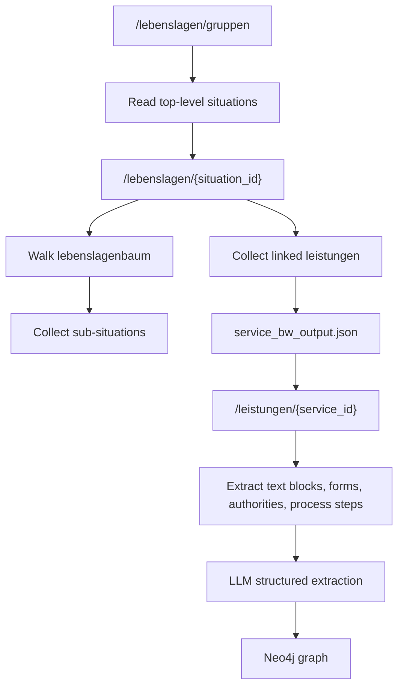

# Challenges And Solutions

This document describes the main implementation problems faced in the project and how they were solved.

## 1. Service-BW Was Not Simple To Scrape

### Problem

At first, Service-BW looked like a normal website that could be scraped through HTML. In practice, this was not reliable. The visible pages are application-style pages, and the useful structured content is not always available as clean static HTML.

This made normal scraping difficult because:

- page text was incomplete or mixed with layout/navigation
- service relationships were not easy to detect from HTML
- service details such as forms, authorities, and text sections were not consistently extractable
- life-situation trees were hard to reconstruct from pages alone

### Solution

The project uses Service-BW REST API endpoints instead of relying only on HTML scraping.

Main API endpoints:

```text
GET https://www.service-bw.de/rest/api/lebenslagen/gruppen
GET https://www.service-bw.de/rest/api/lebenslagen/{situation_id}
GET https://www.service-bw.de/rest/api/leistungen/{service_id}
```

### API Structure Used

`/lebenslagen/gruppen` returns the top-level groups and life situations.

Useful fields:

```text
gruppen[]
  lebenslagen[]
    id
    name
```

`/lebenslagen/{id}` returns one life situation or sub-situation.

Useful fields:

```text
id
name
textbloecke
lebenslagenbaum
  untergeordneteLebenslagen[]
leistungen[]
  id
  name
```

`/leistungen/{id}` returns one administrative service.

Useful fields:

```text
id
name
textbloecke
formulare
organisationseinheiten
prozesse
regionalisierbar
```

### Final Scraping Flow



This made the crawler more stable and gave a repeatable source file: `scrapping/service_bw_output.json`.

## 2. Mapping User Language To Official Administrative Terms

### Problem

Users ask in everyday language, but Service-BW uses official German procedure names.

Example:

```text
I moved into a new apartment. What should I do?
```

The relevant official service might be:

```text
Wohnsitz als Hauptwohnsitz anmelden
```

### Solution

The system uses a retrieval agent to produce compact German administrative search phrases. Those phrases are used for graph vector search and web fallback search.

The intake prompt was also adjusted so that missing details such as exact city or document status do not automatically block retrieval when the administrative topic is already clear.

## 3. Raw Graph Search Was Too Weak

### Problem

Searching only situation or service descriptions was often not enough. Users ask practical questions, but official pages may be structured around headings, legal terms, and long descriptions.

### Solution

The project added `ServiceQA` nodes.

For every service, the LLM can generate 4-8 grounded German Q&A facts such as:

```text
question: Welche Unterlagen werden benötigt?
answer: ...
service_id: ...
```

These nodes are linked to the service:

```text
(:Service)-[:HAS_QA]->(:ServiceQA)
```

They reuse the existing chunk and vector embedding pipeline.

At query time:

```text
ServiceQA vector match -> service_id -> full service details
```

This helps the system find a service using user-like questions while still grounding the final answer in the full service details.

## 4. Existing Data Needed New ServiceQA Without Full Rescrape

### Problem

After adding `ServiceQA`, the graph already contained many services. Re-scraping and rebuilding everything would be slow and unnecessary.

### Solution

A backfill script was added:

```bash
python3 scrapping/backfill_service_qa.py
```

It reads existing services and their graph details from Neo4j, asks the LLM to create Q&A facts, stores `ServiceQA` nodes, and embeds them.

This allows incremental improvement of the graph.

## 5. LLMs Sometimes Returned Invalid JSON

### Problem

Some LLM calls returned JSON inside Markdown fences or added explanation text around JSON.

Example:

~~~text
Here is the JSON:
```json
{ ... }
```
~~~

The original parser expected pure JSON and failed. This caused the intake agent or judge agent to fall back incorrectly.

### Solution

The JSON parser was improved to:

- remove Markdown code fences
- accept dict/list objects directly
- scan text for the first valid JSON object or array

This made intake and evaluation more robust.

## 6. The Agent Asked Too Many Clarification Questions

### Problem

The first evaluation run showed many questions were routed to `clarify`, even when the topic was clearly administrative. This prevented retrieval from running at all.

### Solution

The intake prompt was changed:

- clear administrative procedure questions should route to `admin`
- missing city, exact address, nationality, or appointment date should be stored as missing information
- missing details should not block retrieval when a useful search can still be made

The assistant should give general guidance first and ask focused follow-up questions only where necessary.

## 7. Evaluation Questions Were Too Broad

### Problem

The first 100 evaluation questions covered many German administrative topics, but not all were guaranteed to exist in the local Service-BW graph. This made the evaluation unfair because it tested missing knowledge rather than the system's actual graph retrieval quality.

### Solution

The question file was rebuilt around actual Service-BW service names from `scrapping/service_bw_output.json`, using local context such as `Marxzell 76359`.

This makes evaluation more focused:

- the asked procedure likely exists in the graph
- retrieval can be measured more fairly
- wrong answers are more likely caused by retrieval/ranking issues rather than missing data

## 8. Evaluation Needed To Be Separate From The Main App

### Problem

Evaluation code should not mix with the production assistant flow.

### Solution

A separate folder was added:

```text
evaluation_flow/
```

It contains:

- `questions.txt`
- `run_evaluation.py`
- `README.md`

The runner sends questions to the existing assistant as a black box and uses a separate judge LLM to score the answers.

## 9. Logs Were Too Noisy

### Problem

Graph ingestion and vector index handling printed too many low-value messages. This made it hard to see real progress and failures.

### Solution

The internal graph writer was changed to quiet mode by default. Backfill scripts now print compact progress summaries, and low-level messages use logging instead of unconditional print statements.

## 10. Retrieval Can Still Return Unrelated Services

### Current Problem

Even after improving routing, some vector searches can still return unrelated services if the query is broad or if a weak ServiceQA match has a high vector score.

### Current Mitigation

The system now returns retrieval reasons and service details so bad matches can be inspected during evaluation.

### Future Improvement

Possible next improvements:

- add keyword overlap filtering before passing services to the solution agent
- boost exact service-name matches
- rerank retrieved services with an LLM
- use graph constraints to prefer services connected to matched sub-situations
- add negative filtering for obviously unrelated service categories
